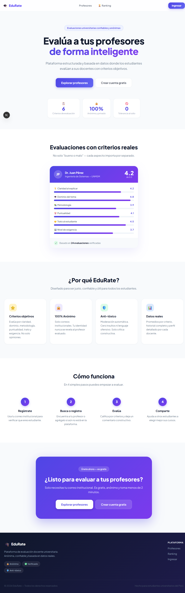
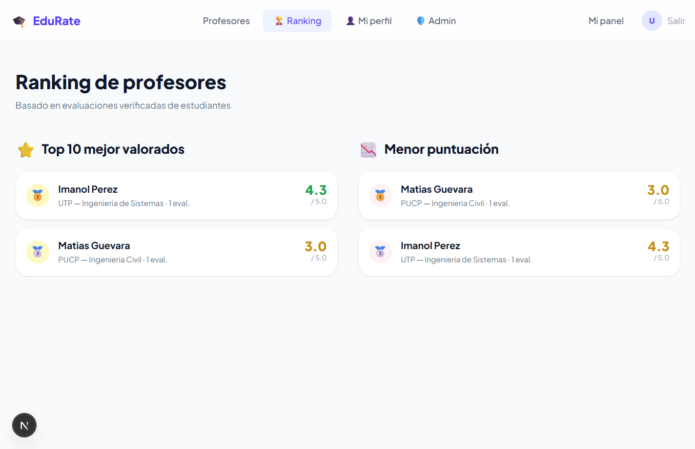
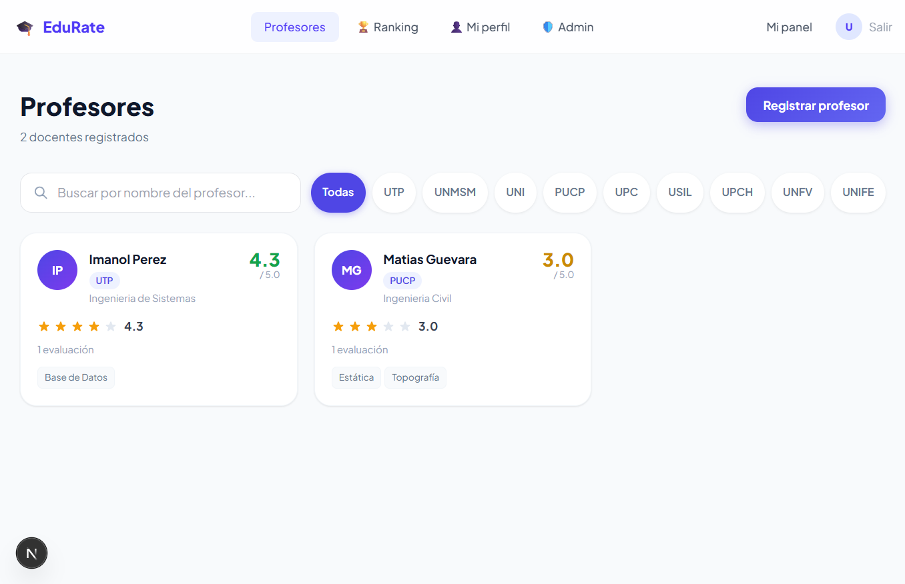
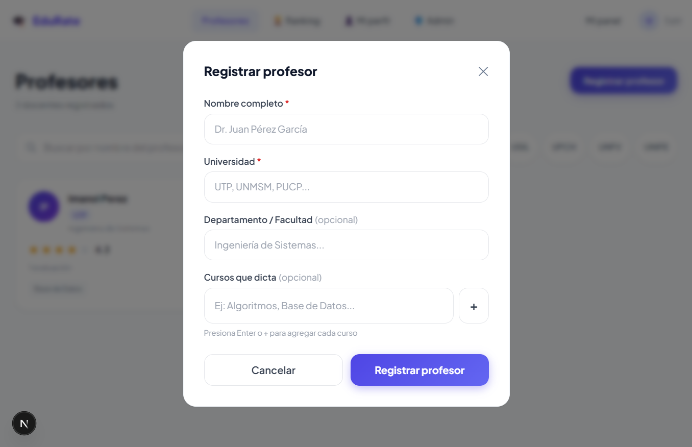
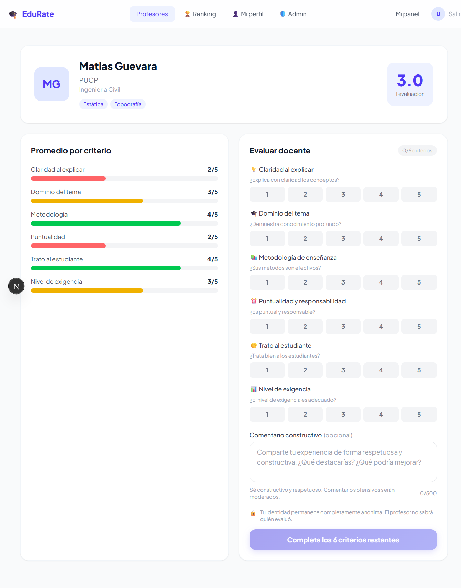

# 🎓 EduRate

Plataforma web de evaluación docente universitaria, anónima y confiable. Los estudiantes evalúan a sus profesores usando criterios objetivos y datos reales.

## ✨ Características

- 🔒 **Autenticación por correo institucional** — Magic Link sin contraseñas
- ⭐ **6 criterios de evaluación** — Claridad, Dominio, Metodología, Puntualidad, Trato y Exigencia
- 🛡️ **Sistema anti-tóxico automático** — Detecta y elimina lenguaje ofensivo
- 📊 **Ranking de profesores** — Top mejores y peores valorados
- 👤 **Panel del estudiante** — Ver, editar y eliminar tus evaluaciones
- 🚩 **Sistema de reportes** — Los usuarios pueden reportar comentarios inapropiados
- 🔍 **Búsqueda y filtros** — Por nombre y universidad
- 📱 **Responsive** — Funciona en móvil y desktop

## 🛠️ Tecnologías

| Tecnología | Uso |
|---|---|
| [Next.js 15](https://nextjs.org/) | Framework fullstack (frontend + API routes) |
| [TypeScript](https://www.typescriptlang.org/) | Tipado estático |
| [Tailwind CSS v4](https://tailwindcss.com/) | Estilos y diseño |
| [Supabase](https://supabase.com/) | Base de datos PostgreSQL + Autenticación |
| [@supabase/ssr](https://supabase.com/docs/guides/auth/server-side) | Manejo de sesiones SSR |
| [Vercel](https://vercel.com/) | Deploy y hosting |

## 📸 Capturas de pantalla

<div align="center">
  <table>
    <tr>
      <td width="50%" align="center">
        
        <br />
        <b>Panel del Estudiante (Dashboard)</b>
      </td>
      <td width="50%" align="center">
        
        <br />
        <b>Ranking de Profesores</b>
      </td>
    </tr>
    <tr>
      <td width="50%" align="center">
        
        <br />
        <b>Búsqueda y Lista de Profesores</b>
      </td>
      <td width="50%" align="center">
        
        <br />
        <b>Registrar Nuevo Profesor</b>
      </td>
    </tr>
    <tr>
      <td width="100%" align="center" colspan="2">
        
        <br />
        <b>Formulario de Evaluación (Criterios y Moderación)</b>
      </td>
    </tr>
  </table>
</div>


## 📁 Estructura del proyecto
edurate/
├── app/
│   ├── page.tsx              # Landing page
│   ├── auth/                 # Login y registro
│   ├── professors/           # Lista y perfil de profesores
│   ├── dashboard/            # Panel del estudiante
│   ├── ranking/              # Ranking de profesores
│   ├── profile/              # Perfil del usuario
│   ├── admin/                # Panel de administración
│   └── api/                  # API Routes (REST)
│       ├── auth/             # me, logout, sync
│       ├── professors/       # CRUD de profesores
│       ├── evaluations/      # Crear, editar, eliminar
│       ├── reports/          # Sistema de reportes
│       ├── profile/          # Actualizar perfil
│       └── admin/            # Gestión de reportes
├── components/               # Componentes reutilizables
│   ├── Navbar.tsx
│   ├── EvaluationForm.tsx
│   ├── DashboardClient.tsx
│   ├── RankCard.tsx
│   ├── ReportButton.tsx
│   └── ProfileClient.tsx
└── lib/
├── supabase.ts           # Cliente público
├── supabase-admin.ts     # Cliente servidor
├── session.ts            # Manejo de sesión
├── auth.ts               # Validación de correo institucional
└── moderation.ts         # Sistema anti-tóxico

## 🚀 Instalación local

### 1. Clonar el repositorio
```bash
git clone https://github.com/TU_USUARIO/edurate.git
cd edurate
```

### 2. Instalar dependencias
```bash
npm install
```

### 3. Configurar variables de entorno

Copia el archivo de ejemplo y rellena con tus valores:
```bash
cp .env.example .env.local
```
```env
NEXT_PUBLIC_SUPABASE_URL=tu_url_de_supabase
NEXT_PUBLIC_SUPABASE_ANON_KEY=tu_anon_key
SUPABASE_SERVICE_ROLE_KEY=tu_service_role_key
NEXT_PUBLIC_APP_URL=http://localhost:3000
ALLOWED_EMAIL_DOMAINS=utp.edu.pe,unmsm.edu.pe,uni.edu.pe,pucp.edu.pe,upc.edu.pe
```

### 4. Configurar la base de datos

Ejecuta el schema SQL en **Supabase → SQL Editor**:
```sql
-- Habilitar extensiones
create extension if not exists "uuid-ossp";

-- Tabla usuarios
create table users (
  id uuid primary key default uuid_generate_v4(),
  email text unique not null,
  full_name text,
  university text,
  is_verified boolean default false,
  is_admin boolean default false,
  created_at timestamptz default now()
);

-- Tabla profesores
create table professors (
  id uuid primary key default uuid_generate_v4(),
  full_name text not null,
  university text not null,
  department text,
  photo_url text,
  avg_rating numeric(3,2) default 0,
  total_evaluations int default 0,
  created_at timestamptz default now()
);

-- Tabla cursos
create table courses (
  id uuid primary key default uuid_generate_v4(),
  professor_id uuid references professors(id) on delete cascade,
  name text not null,
  code text
);

-- Tabla evaluaciones
create table evaluations (
  id uuid primary key default uuid_generate_v4(),
  professor_id uuid references professors(id) on delete cascade,
  user_id uuid references users(id) on delete set null,
  clarity int check (clarity between 1 and 5),
  knowledge int check (knowledge between 1 and 5),
  methodology int check (methodology between 1 and 5),
  punctuality int check (punctuality between 1 and 5),
  treatment int check (treatment between 1 and 5),
  rigor int check (rigor between 1 and 5),
  avg_score numeric(3,2),
  comment text,
  is_approved boolean default true,
  is_flagged boolean default false,
  flag_reason text,
  reported_count int default 0,
  moderated_at timestamptz,
  created_at timestamptz default now()
);

-- Índice para evitar evaluaciones duplicadas
create unique index one_eval_per_professor
  on evaluations(user_id, professor_id);

-- Tabla reportes
create table reports (
  id uuid primary key default uuid_generate_v4(),
  evaluation_id uuid references evaluations(id) on delete cascade,
  reporter_user_id uuid references users(id) on delete set null,
  reason text not null,
  details text,
  status text default 'pending' check (status in ('pending', 'reviewed', 'dismissed')),
  created_at timestamptz default now()
);

-- Trigger para actualizar promedio del profesor
create or replace function update_professor_avg()
returns trigger as $$
begin
  update professors
  set
    avg_rating = coalesce(
      (select round(avg(avg_score)::numeric, 2)
       from evaluations
       where professor_id = coalesce(NEW.professor_id, OLD.professor_id)
       and is_approved = true),
      0
    ),
    total_evaluations = (
      select count(*) from evaluations
      where professor_id = coalesce(NEW.professor_id, OLD.professor_id)
      and is_approved = true
    )
  where id = coalesce(NEW.professor_id, OLD.professor_id);
  return coalesce(NEW, OLD);
end;
$$ language plpgsql;

create trigger trigger_update_avg
after insert or update or delete on evaluations
for each row execute function update_professor_avg();

-- Función para incrementar reportes
create or replace function increment_report_count(eval_id uuid)
returns void as $$
begin
  update evaluations
  set reported_count = coalesce(reported_count, 0) + 1
  where id = eval_id;
end;
$$ language plpgsql;

-- Deshabilitar RLS para desarrollo
alter table users disable row level security;
alter table professors disable row level security;
alter table courses disable row level security;
alter table evaluations disable row level security;
alter table reports disable row level security;
```

### 5. Correr el proyecto
```bash
npm run dev
```

Abre [http://localhost:3000](http://localhost:3000)

## 🔐 Variables de entorno

| Variable | Descripción |
|---|---|
| `NEXT_PUBLIC_SUPABASE_URL` | URL de tu proyecto en Supabase |
| `NEXT_PUBLIC_SUPABASE_ANON_KEY` | Clave pública de Supabase |
| `SUPABASE_SERVICE_ROLE_KEY` | Clave privada de Supabase (solo servidor) |
| `NEXT_PUBLIC_APP_URL` | URL base de la app |
| `ALLOWED_EMAIL_DOMAINS` | Dominios de correo permitidos, separados por coma |

## 👤 Roles de usuario

| Rol | Permisos |
|---|---|
| **Estudiante verificado** | Registrar profesores, evaluar, editar y eliminar sus evaluaciones, reportar comentarios |
| **Administrador** | Todo lo anterior + ver y gestionar reportes en `/admin` |

Para hacer un usuario administrador:
```sql
update users set is_admin = true where email = 'correo@universidad.edu.pe';
```

## 🌐 Deploy en Vercel

1. Sube el proyecto a GitHub
2. Importa el repositorio en [vercel.com](https://vercel.com)
3. Agrega las variables de entorno en Vercel
4. Haz deploy
5. Actualiza las URLs en **Supabase → Authentication → URL Configuration**:
   - Site URL: `https://tu-app.vercel.app`
   - Redirect URLs: `https://tu-app.vercel.app/auth/callback`

## 📄 Licencia

Este proyecto está bajo la licencia MIT.  
Puedes usarlo, modificarlo y distribuirlo libremente, siempre que se incluya el crédito al autor.

--- 

